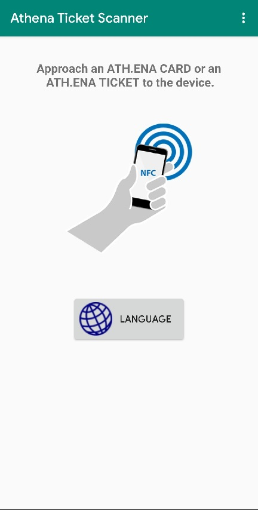
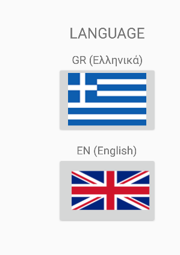
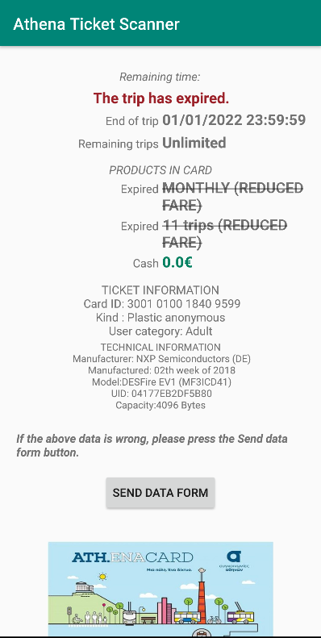

# Athena Ticket Scanner
An android application that reads information from greek public transport tickets, using NFC.

# Short description
Athena ticket scanner, is an application that reads info from OASA tickets, and shows it to the user in an convenient and friendly GUI.
Using it is extremely easy, just tap an ATH.ENA TICKET or ATH.ENA CARD on your device's NFC sensor, and the app will show ticket information (trips left, time left on active trip, ticket ID, user profile etc.)

# Languages
Currently, available languages are Greek and English

# Device requirements
* Android 4.3 or newer
* NFC sensor

# User interface
Main screen (upon app launch) : 
  
To change language, select the "Language/Γλώσσα" button  
Language picker screen :  
  
UI after scanning an expired ticket :  
  

# Installation
Latest app version is available on Google Play Store, link : https://play.google.com/store/apps/details?id=com.tonyTsoftware.nfctagreader2 
or the release section of this repository (in APK form).
