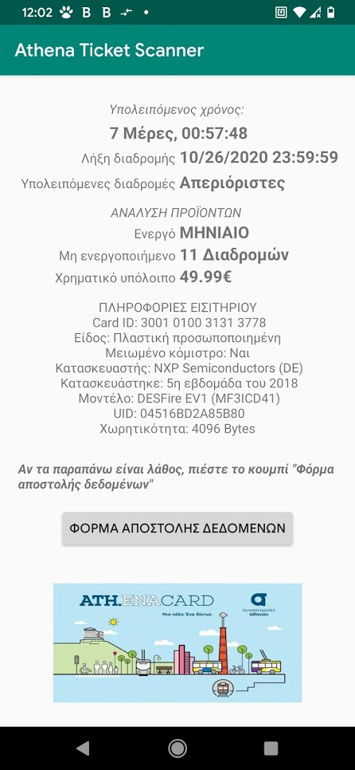

# Athena-Ticket-Scanner
An android application that reads information from greek public transport tickets, using NFC.

# Short description
Athena ticket scanner, is an application that reads info from OASA tickets, and shows it to the user in an convenient and friendly GUI.
~~Currently the application is only available in greek, but an english translation is coming soon.~~
An english translation for the app is also availble as of version 1.3 .

# Usage
To use the app, simply download it from the [github repo](https://github.com/AnthonyThomahawk/Athena-Ticket-Scanner/releases) , or [playstore](https://play.google.com/store/apps/details?id=com.tonyTsoftware.nfctagreader2) , then
install it. All you have to do now, is approach an ATH.ENA OASA Ticket on your NFC capable device, and the app will show you all useful information about it (trip time left, trips left, active products, remaning balance and many more). You can also open the app, and scan a ticket from there, otherwise when you approach the ticket the app will automatically open.

GUI after a ticket has been scanned :

The app also has a real-time countdown, showing you how much time you have left on your trip.

# Requirements
In order to use the app, your phone must have android 4.2 or newer, and NFC functionality.

# Source code
The source code is not publicly availble yet, however it is planned to be released in the near future.
for now you can download  the releases from this github repo, or from [playstore](https://play.google.com/store/apps/details?id=com.tonyTsoftware.nfctagreader2)
